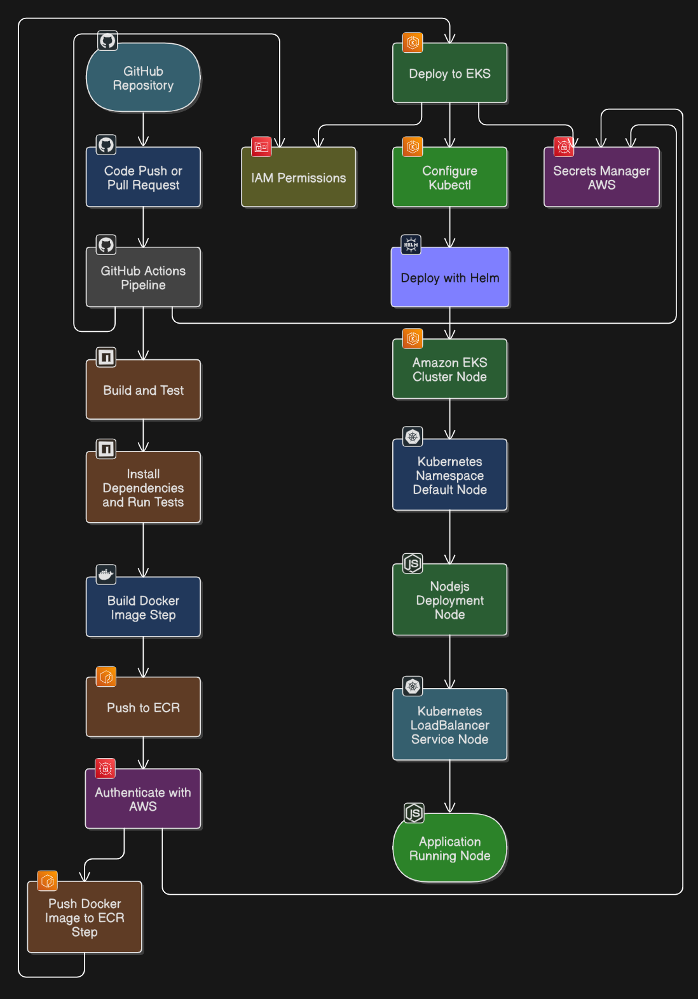
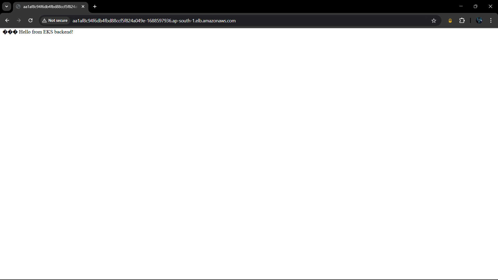

# CI/CD Pipeline: Node.js App Deployment on AWS EKS via GitHub Actions
---

## 📌 Project Overview
This project demonstrates a **complete DevOps CI/CD pipeline** using:
- **GitHub Actions** for automation
- **Docker** for containerization
- **Amazon ECR** for image registry
- **Amazon EKS (Kubernetes)** for container orchestration
- **Helm** for application deployment

The pipeline automatically builds, pushes, and deploys a Dockerized Node.js application to AWS on every push to the `main` branch.

---

## 🛠 Tech Stack
- Node.js (Express backend)
- Docker
- GitHub Actions
- AWS ECR, EKS, IAM
- Helm (Kubernetes package manager)
- eksctl (EKS CLI setup)

---

## 🧭 Architecture Diagram (PlantUML)



---

## 🔧 Setup Instructions

### 1. Clone & Build the App
```bash
git clone https://github.com/vishnuvardhan148/eks-devops-pipeline.git
cd eks-devops-pipeline
```

### 2. Create Docker Image
```bash
docker build -t <your-image-name> .
docker run -p 3000:3000 <your-image-name>
```

---

### 3. Push to Amazon ECR
```bash
aws ecr create-repository --repository-name eks-devops-node-app
aws ecr get-login-password | docker login --username AWS --password-stdin <ecr-uri>
docker tag <your-image-name> <ecr-uri>:latest
docker push <ecr-uri>:latest
```

---

### 4. Setup Amazon EKS
```bash
eksctl create cluster \
--name eks-devops-cluster \
--region ap-south-1 \
--nodegroup-name linux-nodes \
--node-type t3.small \
--nodes 1 \
--managed
```

### 5. Deploy with Helm
```bash
helm upgrade node-app ./eks-node-app \
--install \
--set image.repository=<ecr-uri> \
--set image.tag=latest
```

---

## ⚙ GitHub Actions Workflow
Path: `.github/workflows/deploy.yaml`

- Builds image and pushes to ECR
- Updates kubeconfig
- Deploys using Helm to EKS

```yaml
on:
  push:
    branches:
      - main

jobs:
  deploy:
    runs-on: ubuntu-latest
    steps:
    - uses: actions/checkout@v4
    - uses: aws-actions/configure-aws-credentials@v2
      with:
        aws-access-key-id: ${{ secrets.AWS_ACCESS_KEY_ID }}
        aws-secret-access-key: ${{ secrets.AWS_SECRET_ACCESS_KEY }}
        aws-region: ${{ secrets.AWS_REGION }}
    - run: aws eks update-kubeconfig --region ${{ secrets.AWS_REGION }} --name ${{ secrets.EKS_CLUSTER_NAME }}
    - run: |
        IMAGE_URI=${{ secrets.ECR_REPO_URI }}:latest
        docker build -t $IMAGE_URI .
        docker push $IMAGE_URI
    - run: |
        helm upgrade node-app ./eks-node-app \
          --install \
          --set image.repository=${{ secrets.ECR_REPO_URI }} \
          --set image.tag=latest
```

---

## 🧼 Cleanup Strategy (to avoid AWS charges)
After testing:
```bash
# Delete cluster
eksctl delete cluster --name eks-devops-cluster --region ap-south-1

# Delete ECR repo
aws ecr delete-repository --repository-name eks-devops-node-app --force

# Optional IAM role cleanup
aws iam delete-role --role-name github-actions-role-name
```

---

## 📸 Screenshots

| GitHub Actions Workflow | EKS Dashboard | App Running on LoadBalancer |
|--------------------------|----------------|-----------------------------|
|  |  |  |

---

## 📅 Completed On: `2025-07-06`

---

## 💬 Let's Connect
If you're a recruiter or cloud enthusiast and want to talk DevOps, feel free to connect on [LinkedIn](https://www.linkedin.com/in/vishnu-vardhan-gurram/)!

---

**#AWS #EKS #GitHubActions #DevOps #CICD #CloudComputing #Docker #Kubernetes #Helm #InfrastructureAsCode**
